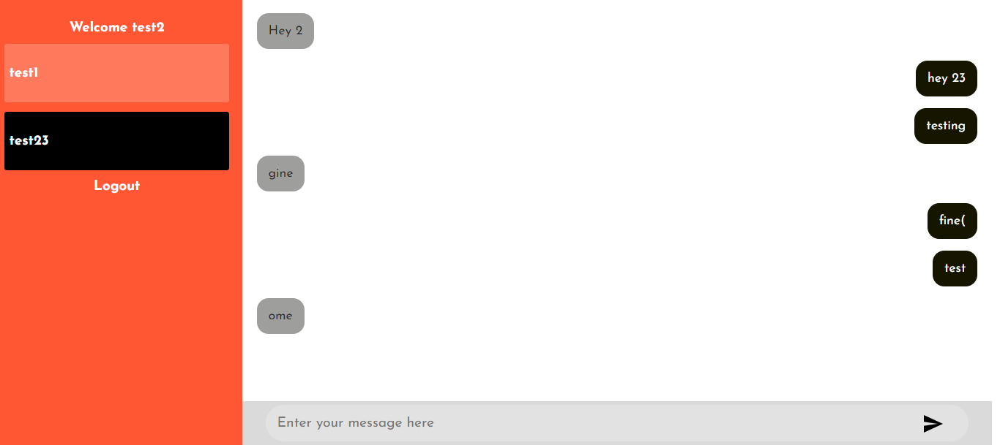

## Installation Guide

### Requirements
- [Nodejs](https://nodejs.org/en/download)
- [Mongodb](https://www.mongodb.com/docs/manual/administration/install-community/)

Both should be installed and make sure mongodb is running.

```shell
https://github.com/ManishgandotraCoder/code.git
cd code
```
Now rename env files from .env.example to .env
```shell
cd client-side
mv .env.example .env
cd ..
cd server-side
mv .env.example .env
cd ..
```

Now install the dependencies
```shell
cd server-side
yarn
cd ..
cd client-side
yarn
```
We are almost done, Now just start the development server.

For Frontend.
```shell
cd public
yarn start
```
For Backend.

Open another terminal in folder, Also make sure mongodb is running in background.
```shell
cd server
yarn start
```

Done! Now open localhost:3000 in your browser.

Task 

Frontend (React):
Develop a login form with proper error handling.

Login form is created . 


Implement a chat feature using Socket.io, allowing user to send and receive messages.

Real time chat functionality is created 


Backend (Node.js):

Develop a Node.js server to handle user authentication and real-time communication using Socket.io.

Implement user registration and login endpoints with proper validation.
    APIs are created for both 
    Login 
    http://localhost:5000/api/auth/login
    

    Register 
    http://localhost:5000/api/auth/register
    

    Use JSON Web Tokens (JWT) for user authentication.
    JWT Token Auth has been created 

Implement Socket.io to handle chat between users.
    Socket.io is used to create Real time functionality


APIs 

1. Register 
    URL : http://localhost:5000/api/auth/register 
    Request : POST
    Payload : {
    "username" : "test23",
    "password": "test@123",
    "email":"test23@gmail.com"
    }
2. Login 
    URL : http://localhost:5000/api/auth/login 
    Request : POST
    Payload : {
    "username" : "test23",
    "password": "test@123",
    }
3. 
    URL : http://localhost:5000/api/auth/allusers/650f1c30f99eb313c924e074    
    Request : GET
    headers : {
    token : 'Bearer token'
    }
4. Get message 
    URL : http://localhost:5000/api/messages/getmsg
    Request : POST 
    headers : {
    token : 'Bearer token'
    }
    Payload : {
        from : "senderid"
        to :"receiver id"
    }
5. Send message 
    URL : http://localhost:5000/api/messages/addmsg
    Request : POST 
    headers : {
    token : 'Bearer token'
    }
    Payload : {
        from : "senderid"
        to :"receiver id"
    }
6. Logout
    URL : http://localhost:5000/api/auth/logout/650f1c30f99eb313c924e074
    Request : GET
        headers : {
        token : 'Bearer token'
    }

export const logoutRoute = `${host}/api/auth/logout`;
